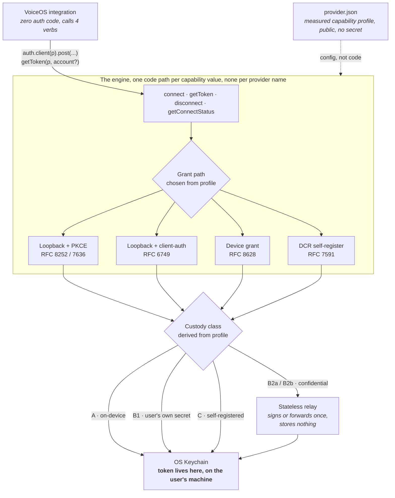

# VoiceOS Native OAuth Engine

Real OAuth for VoiceOS custom integrations. No Composio, no third party broker, no pasted API keys.

**What it is:** one provider-agnostic engine (codename Handshake) that makes the `auth: "oauth2"` slot actually work for any VoiceOS custom integration. Everything a provider does differently is a measured field in one `provider.json` config file; the engine holds no tokens and has no per-provider code.

**What it lets you do:**

- Say **"connect Slack"** (or any provider) and the provider's own approval page opens. One tap, connected.
- Tokens are minted straight into the OS Keychain, encrypted. They never transit VoiceOS or any third party server.
- Ship a new provider with one `provider.json` and **zero lines of auth code**.
- Your integration calls four verbs (`connect`, `getToken`, `disconnect`, `getConnectStatus`) and never touches a token, a redirect, or a refresh timer.

<sub>625 tests · 41 test files · zero runtime dependencies · a 9-case blind red-team corpus · `make verify` is the whole contract in one command.</sub>

**New here? Start with [GETTING-STARTED](docs/GETTING-STARTED.md):** what this lets you do and how to ship your first integration on it.

---

## The problem it solves

VoiceOS has two worlds. The famous connectors get a real **Connect** button, brokered server-side, with every user's tokens living on a third party's infrastructure. **"Build Anything"**, the actual differentiator, ships an `auth.kind: "oauth2"` slot in the manifest with **nothing behind it**: no callback, no token exchange, no refresh. The only path that works today is pasting a raw API key into a text field, where it sits in plaintext on disk. The shipped Stripe example stores a `client_secret` in the clear.

So the promise is "build anything" and the reality is "build anything, as long as it authenticates with a pasted secret." This engine fills the dead slot: a spoken **"connect &lt;provider&gt;"** opens the provider's own Allow screen, the token lands **encrypted in the login Keychain**, and it never transits VoiceOS or any third-party server.

The per-provider tool code, the integration itself, is a **separate layer built on top of this engine** and is not in this repo. This repository is only the engine: the auth broker, the provider-profile contract, the stateless relay, and the tooling that proves them.

---

## Architecture at a glance

**One engine. Per-provider *config*, never per-provider *code*.** `if (provider === 'slack')` is a permanent bug here, enforced by a test that greps the source and fails the build ([INV-CONFIG-1](docs/handshake/INVARIANTS.md)). Every way providers differ, PKCE support, client-auth requirement, redirect rules, refresh rotation, token shape, DCR, is a measured field in a `provider.json`, and every field *value* maps to exactly one code path.



An integration calls four verbs, `connect`, `getToken`, `disconnect`, `getConnectStatus`, and never touches a token, a redirect, or a refresh timer. The profile decides the grant path; the grant path and its client-auth requirement together *derive* the custody class; custody decides whether a byte ever leaves the machine. No provider name appears anywhere in that chain.

---

## The five custody classes

Custody is **derived** from the measured profile, not chosen by hand, and shown to the user at connect time. Strongest to weakest:

| Class | One sentence |
|---|---|
| **A, public / PKCE** | `client_auth: none` + `pkce: S256`, fully on-device, no secret anywhere, nothing touches VoiceOS or any server. |
| **B1, bring-your-own secret** | The user registers their own app with the provider; their `client_secret` lives in their own keychain, nothing distributed, nothing shared. |
| **B2a, relay assertion-signing** | Where the provider supports `private_key_jwt`, a stateless relay signs a request-scoped client assertion and the device does the exchange itself, the relay never sees the code, verifier, or token. |
| **B2b, relay encrypted-forwarding** | Where a raw shared secret is unavoidable, the relay performs one exchange and returns the token sealed to the device's ephemeral X25519 key, then wipes the plaintext, it sees one token, one moment, one flow, and stores nothing. |
| **C, DCR self-register** | The provider supports RFC 7591 dynamic client registration, so the engine self-registers a client per user and the credentials live on the device. |

**The audit sentence.** Compromising the relay yields the ability to complete future exchanges for the one app whose secret it holds, plus (B2b only) any token *in flight at that instant*, never a stored token, because the relay stores none. Compromising a classic broker yields every connected user's live tokens, at rest, indefinitely. Different orders of magnitude, and the difference is architectural, not a policy promise.

---

## Grant paths

Four paths, selected from the profile, no provider is unsupported, some just carry more ceremony:

1. **Loopback authorization code with PKCE** (RFC 8252 + RFC 7636), the preferred path: public client, no secret, fully on-device.
2. **Loopback authorization code with client authentication** (RFC 6749), identical up to the token exchange, which needs a secret and therefore a custody decision (B1 / B2a / B2b).
3. **Device authorization grant** (RFC 8628), a short user code and a URL, for headless boxes, remote sessions, and providers that refuse loopback redirects.
4. **Dynamic client registration** (RFC 7591), the engine registers a client on the fly; credentials stay on the device (Custody Class C).

---

## Quickstart

Node ≥ 22.18 (runs TypeScript natively, the engine has **zero runtime dependencies**). No account, no registration, no secret needed to see it work end to end.

```bash
npm ci         # build-time toolchain only (TypeScript + vitest); the engine ships zero runtime deps
make demo      # real engine · real HTTP OAuth · built-in mock provider
make verify    # the full gate, green means the entire contract holds
```

**`make demo`** runs the whole round trip against a built-in mock authorization server and needs **no install at all**, it is pure node. `connect()` opens the flow and returns in ~1 second while consent completes out of band; the token is exchanged and vaulted; `auth.client()` calls a protected resource with a token the calling code never sees; then the access token is force-expired to prove the silent **401 → refresh → retry → 200** path.

**`make verify`** is the engine's Definition-of-Done in one command. It runs, cheap-fails-first: build → typecheck → the contract-lock invariants → zero-dependency check → secret scan → the no-per-provider-branch guard → the **full 625-test suite** across 41 files. Any single gate failing stops it with a non-zero exit, there is no "mostly green." It installs its own toolchain on first run, so it is green from a truly cold clone.

```
Test Files  41 passed (41)
     Tests  625 passed (625)
verify: ALL GATES GREEN, build · typecheck · invariants · zero-dep · no-secret-leak · no-per-provider-branch · full suite
```

---

## Add any provider in ~20 lines

A new provider costs **zero lines of auth code** and one `provider.json`, the capability profile, nothing more. Register it into your integration and the same four verbs light up:

```js
import { registerProvider } from './engine/src/index.ts';
registerProvider(profile);   // profile = your parsed provider.json, no secret, no code
```

A minimal public/PKCE profile is exactly this shape:

```jsonc
{
  "name": "acme",
  "display_name": "Acme",
  "authorize_url": "https://acme.example/oauth/authorize",
  "token_url": "https://acme.example/oauth/token",
  "scopes": ["read", "write"],
  "pkce": "S256",          // → Custody Class A: fully on-device, no secret
  "client_auth": "none",
  "client_id": "public-client-id"
}
```

Every field is validated against the frozen [`provider.schema.json`](provider.schema.json) contract. See **[docs/ADD-A-PROVIDER.md](docs/ADD-A-PROVIDER.md)** for the fully worked walkthrough and the runnable reference (`tools/mock-provider/` + `make demo`).

---

## Anyone can self-register a provider, no allow-list

You don't wait for the engine to "support" your provider, and you never hand-transcribe its capabilities. Two mechanisms, both already in the tree:

- **The conformance probe** (`node tools/probe.mjs <url> --name <name>`) points at *any* provider, runs the safe measurement sequence, RFC 8414 / OIDC discovery → unauthenticated-exchange client-auth classification → redirect tolerance, and writes `providers/<name>.json` plus a `<name>.evidence.json` receipt. Every field in the profile has a measurement behind it; anything the probe can't determine is written as `unknown` rather than guessed. The probe **never** accepts a client secret, on argv, in an env var, or in a file.
- **DCR (RFC 7591)** lets a provider that offers a registration endpoint be self-registered per user at connect time, with the resulting credentials staying on the device (Custody Class C).

The catalog is open by construction: there is no curated allow-list of blessed providers, because there is no per-provider code to bless.

---

## Security posture

- **No token ever lands on disk unencrypted.** Tokens are vaulted in the OS login Keychain (`security add-generic-password`) or, off the macOS path, an authenticated encrypted-file backend, never plaintext, never on a server.
- **No `client_secret` in any committed file, enforced, not promised.** A push-gate secret scanner (`tools/scan-secrets.mjs`) matches credential *shapes* over the whole tree and fails the build on a hit, and it never prints the match. Two invariants, INV-SECRET-1 (nothing secret-shaped in the source) and INV-SECRET-4 (nothing secret-shaped in build output), are asserted by their own guard tests on every `make verify`.
- **The engine is architecturally secret-free.** Zero runtime dependencies means zero transitive supply-chain surface; the only secrets that ever exist are the user's own, and they live in the user's own keychain.
- **A blind red-team corpus.** `engine/test/blind/` is nine adversarial cases authored by a red-team whose only inputs were the spec and the invariants, no engine source was read; the interface was learned only by *running* it. Each test is one attack (state tamper/replay, PKCE downgrade, open redirect, provider mix-up, refresh replay, multi-account confusion, relay assertion oracle, secret leakage, malicious config). A green test means the engine *defended* that attack; every case maps back to a threat-model entry.

Full attack catalog, each entry mapped to a test: **[docs/THREAT-MODEL.md](docs/THREAT-MODEL.md)**.

---

## Docs

| Doc | What's inside |
|---|---|
| [`docs/handshake/SPEC.md`](docs/handshake/SPEC.md) | The capability model, custody classes, threat model, and positioning, in full. |
| [`docs/ARCHITECTURE.md`](docs/ARCHITECTURE.md) | Code-level design, the three layers, the registration strategy, where every decision lives. |
| [`docs/THREAT-MODEL.md`](docs/THREAT-MODEL.md) | The attack catalog, each entry mapped to the test that defends it. |
| [`docs/ADD-A-PROVIDER.md`](docs/ADD-A-PROVIDER.md) | Add any provider in ~20 lines, a fully worked `provider.json`. |
| [`docs/CLAIMS.md`](docs/CLAIMS.md) | Every claim in this README, with the exact command or file that backs it. |

---

## Layout

- `engine/`, the one engine. `engine/src/config.ts` is the sole source of the redirect URI; the integration layer on top contains zero auth code.
- `relay/`, the stateless relay reference (B2a assertion-signing, B2b encrypted-forwarding). No storage, no database, no token retained past one response, proven by `relay/test/statelessness.test.ts`.
- `provider.schema.json`, the frozen v1 provider-profile contract, the machine-readable twin of `engine/src/types.ts`.
- `tools/`, `demo.mjs`, `mock-provider/`, `scan-secrets.mjs`, `drift-check.mjs`, `probe.mjs`, and the rest of the CLI surface.

## Checks

`make verify` needs no prior step. The raw commands assume you have run `npm ci` first (otherwise `npx` resolves an unrelated remote `tsc` package):

```bash
make verify                  # the one-command gate, installs the toolchain, then runs everything, cheap-fails-first
npx vitest run               # the full test suite (625 tests, zero runtime deps)
npx tsc --noEmit             # strict, node-native TypeScript (no emit, node strips types at runtime)
node tools/scan-secrets.mjs  # the push-time secret gate, matches credential shapes, never prints them
make help                    # list every make target
```

## License

MIT, see [LICENSE](LICENSE).
